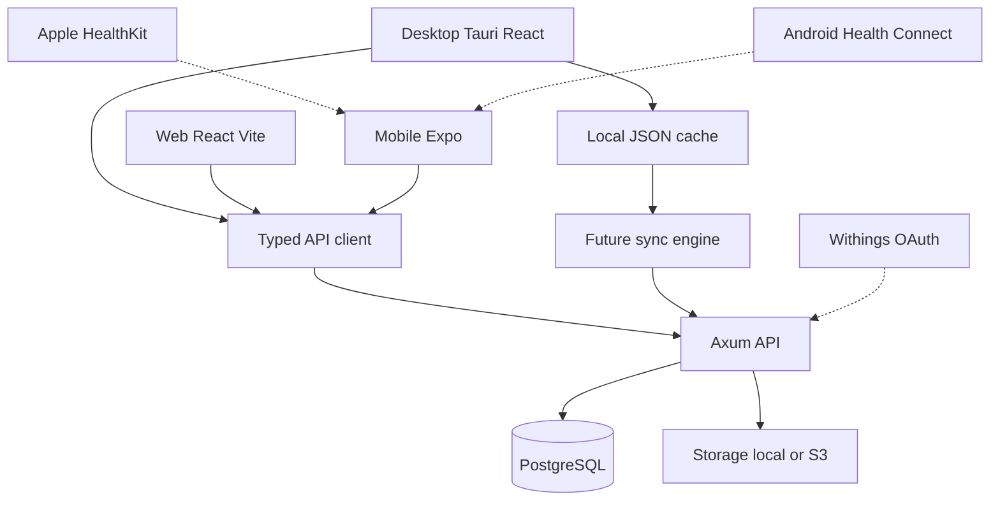

# Architecture

Healthii is a local-friendly, API-centered personal health OS.

## Clients

- **Desktop** is the primary workspace: dashboard, records, charts, import/export.
- **Web** mirrors that experience in the browser with the same React UI package.
- **Mobile** is a companion for adding weight, vitals, workouts, symptoms and documents in seconds.

Shared code lives in `packages/`:

- `types` — DTO contracts
- `api-client` — fetch wrapper
- `design-tokens` — color, type, radius
- `dashboard` — navigation, quick-add, preview view-model
- `ui` — React DOM shell used by web and desktop

React Native does not import `@healthii/ui`. It consumes tokens and the dashboard view-model.

## Backend

Axum modules follow domain boundaries (`auth`, `users`, `measurements`, `laboratory`, `documents`, …). Phase 1 exposes:

- `GET /health`, `GET /ready`, `GET /metrics`
- `POST /api/v1/auth/register|login|logout`
- `GET /api/v1/me`
- `GET /api/v1/dashboard`

Other domains have types ready; routes wait until authorization and migrations exist.

## Storage

`backend/src/storage` is an object-store abstraction. `STORAGE_PROVIDER=local` or `s3`. Document HTTP routes are not mounted until ownership checks exist.

## Integrations (planned)

Native health platforms are **consent-driven adapters**, not the source of truth:

- Apple HealthKit via Expo development builds
- Android Health Connect via Expo development builds
- Withings (and similar vendors) via backend OAuth, token encryption and webhook ingestion

Normalize every import into the Healthii measurement/lab/workout model on the server.

## Local-first

Desktop `LocalCache` writes JSON under the app data directory. A sync engine can sit on this boundary later without rewriting UI.
